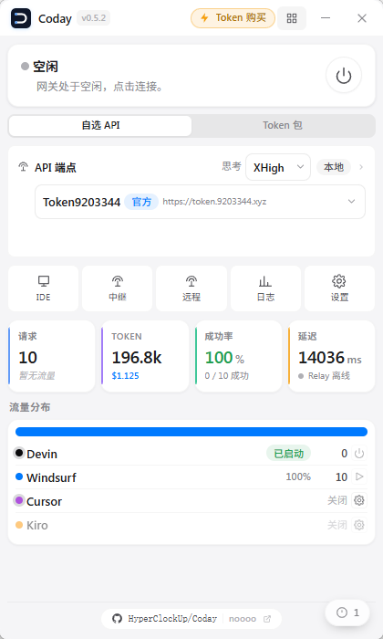

# Coday

在 Cursor、Windsurf、Devin 和 Kiro 中，使用你自己选择的 AI 模型。

[English](./README.md) · 简体中文 · [下载](https://github.com/HyperClockUp/Coday/releases/latest)

  

## 功能

- **多编辑器** — 支持 Cursor、Windsurf、Devin、Kiro，聊天、补全、Agent、工具调用照常使用。
- **跨 IDE Skills 感知** — 自动读取项目中各编辑器的规则文件（.windsurfrules、.cursor/rules、.kiro/steering、CLAUDE.md 等），无论你用哪个编辑器都能获得完整的项目指令。
- **自选模型与源** — 接入任意 OpenAI / Claude 兼容接口，一键同步模型，随时切换。
- **多源故障转移** — 当前源不可用时自动切换到下一个可用源。
- **远程开发** — 支持通过 Remote-SSH 连接的远程主机。
- **自定义人设** — 为每个编辑器单独设置系统提示词（替换或追加）。
- **图像生成** — 可配置独立的出图服务。
- **思考强度** — 全局调节模型 reasoning 强度。
- **网络诊断** — 内置请求查看、日志与状态面板。

## 快速开始

1. [下载](https://github.com/HyperClockUp/Coday/releases/latest)并安装 Coday。
2. 选择一个内置源，或填入你自己的接口地址与 Key。
3. 连接后打开编辑器，照常使用。

## 最近更新

### v0.5.5
- **跨 IDE Skills 感知** — 自动读取项目中各编辑器的规则文件（.windsurfrules、.cursor/rules、.kiro/steering、CLAUDE.md、.devin/ 等），无论你用哪个编辑器都能获得完整的项目指令。
- 增加上游响应超时时间，减少大模型长对话中断。
- 修正 IDE 环境识别：Devin 不再被误认为 VSCode/Cursor。

## 系统要求

Windows 10（x64）及以上。

## Star History

## 反馈

## 许可

Proprietary. 保留所有权利。
